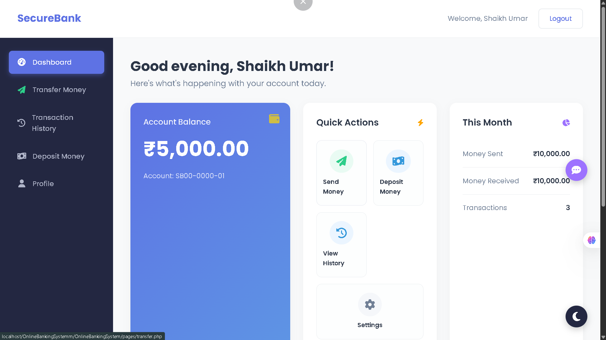
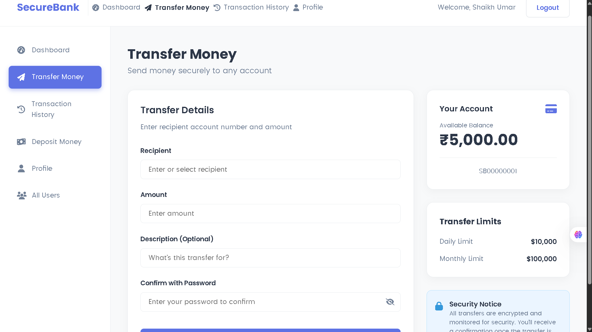
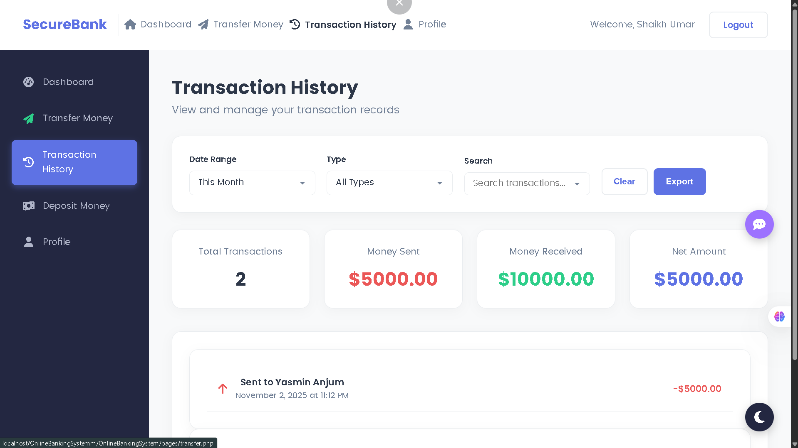
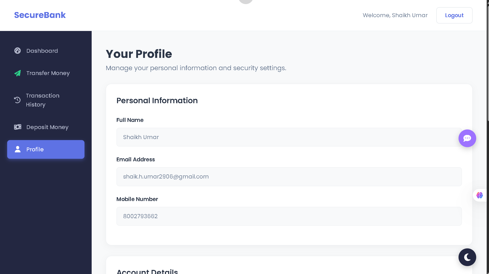
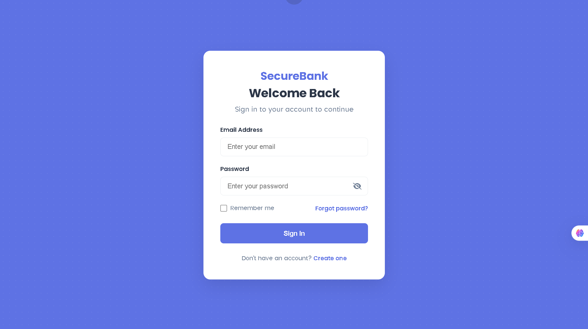
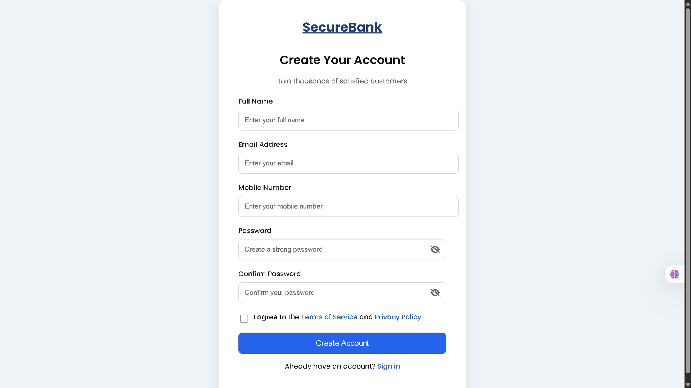

# ✨ SecureBank - Online Banking System

[](https://php.net)
[](https://www.mysql.com/)
[](https://opensource.org/licenses/MIT)
[](https://github.com/Shaik-h-Umar)

A modern and secure web-based banking application built with PHP and MySQL. This project provides a comprehensive suite of features for users to manage their finances, including registration, secure login, fund transfers, transaction history, and profile management.

## 🚀 Tech Stack

-   **Frontend:** HTML5, CSS3, JavaScript
-   **Backend:** PHP
-   **Database:** MySQL
-   **Security:** `password_hash`, `password_verify`, Prepared Statements (mysqli)
-   **Libraries:** Font Awesome

## 📂 Folder/Project Structure

```
OnlineBankingSystem/
├── backend/
│   ├── db_config.php
│   ├── login_process.php
│   ├── register_process.php
│   ├── dashboard_process.php
│   ├── deposit_process.php
│   ├── transfer_process.php
│   ├── transaction_history_process.php
│   ├── Profile_process.php
│   └── ...
├── frontend/
│   ├── assets/
│   │   ├── css/
│   │   ├── js/
│   │   └── images/
│   ├── index.html
│   └── ...
├── pages/
│   ├── login.php
│   ├── register.php
│   ├── dashboard.php
│   ├── deposit.php
│   ├── transfer.php
│   ├── transaction_history.php
│   ├── profile.php
│   └── ...
└── README.md
```

## ✨ Features (Highly Detailed)

-   ✅ **User Registration:** Secure user registration with password hashing and unique account number generation.
-   ✅ **Login Session Security:** Robust login system with session management to protect user accounts.
-   ✅ **Unique Dynamic Account Number Generation:** Automatically generates a unique account number for each new user.
-   ✅ **Dashboard:** A comprehensive overview of the user's account, including current balance, recent transactions, and monthly statistics (money sent/received).
-   ✅ **Deposit Funds:** Users can deposit money into their own accounts.
-   ✅ **Transfer Funds:** Securely transfer funds to other users by their account number, with password confirmation for added security.
-   ✅ **Self-transfer Validation:** Prevents users from transferring money to their own account.
-   ✅ **Insufficient Balance Validation:** Checks for sufficient funds before allowing a transfer.
-   ✅ **Transaction History:** A detailed list of all transactions (sent, received, and deposits).
-   ✅ **Filters & Search:** Frontend-based filtering and search functionality on the transaction history and user list pages.
-   ✅ **Export Button:** A placeholder for exporting transaction data (functionality not yet implemented).
-   ✅ **Copy Account Number Functionality:** Easily copy a user's account number from the "All Users" page.
-   ✅ **Profile Details:** View your personal and account information.
-   ✅ **Password Change with Hashing:** Securely change your password, with verification of the current password.
-   ✅ **UI/UX Highlights:** A modern, clean, and intuitive user interface with a consistent design across all pages.
-   ✅ **Logout System:** Securely log out of the application, destroying the session.

## 🛡️ Security Highlights

-   **Password Hashing:** Uses `password_hash()` and `password_verify()` for secure password storage and verification.
-   **Session Management:** Implements session checks to ensure that only logged-in users can access protected pages.
-   **SQL Injection Prevention:** Utilizes prepared statements (mysqli) for all database queries to prevent SQL injection attacks.
-   **Input Validation:** All user inputs are validated and sanitized to prevent malicious data from being processed.
-   **Error Handling:** Graceful error handling to prevent the exposure of sensitive information.

## ⚙️ Installation Guide

### Prerequisites

-   A web server (e.g., Apache)
-   PHP (version 7.4 or higher)
-   MySQL

### How to Import DB

1.  Create a new database named `securebank` in your MySQL server.
2.  The project does not contain a `.sql` file. You will need to create the tables manually. See the **Database Schema** section for the table structure.

### How to Configure `db_config.php`

1.  Open the `backend/db_config.php` file.
2.  Update the following variables with your database credentials:
    ```php
    $host = "localhost";
    $user = "your_db_user";
    $pass = "your_db_password";
    $dbname = "securebank";
    ```

### Steps to Run Locally

1.  Clone the repository to your local machine.
2.  Place the project folder in your web server's root directory (e.g., `htdocs` for XAMPP).
3.  Start your web server and MySQL.
4.  Access the project through your web browser (e.g., `http://localhost/OnlineBankingSystem/frontend/`).

## 🗄️ Database Schema

### `users` table

| Column         | Type          | Description                               |
| -------------- | ------------- | ----------------------------------------- |
| `id`           | `INT` (PK)    | Unique identifier for each user.          |
| `fullname`     | `VARCHAR(255)`| The user's full name.                     |
| `email`        | `VARCHAR(255)`| The user's email address (used for login).|
| `mobile`       | `VARCHAR(20)` | The user's mobile number.                 |
| `password`     | `VARCHAR(255)`| The user's hashed password.               |
| `account_number`| `VARCHAR(255)`| The user's unique account number.         |
| `balance`      | `DECIMAL(10,2)`| The user's account balance.               |
| `created_at`   | `TIMESTAMP`   | The date and time the user registered.    |

### `transactions` table

| Column        | Type          | Description                                      |
| ------------- | ------------- | ------------------------------------------------ |
| `id`          | `INT` (PK)    | Unique identifier for each transaction.          |
| `sender_id`   | `INT` (FK)    | The ID of the user who sent the money.           |
| `receiver_id` | `INT` (FK)    | The ID of the user who received the money.       |
| `amount`      | `DECIMAL(10,2)`| The amount of money transferred.                 |
| `type`        | `VARCHAR(255)`| The type of transaction (e.g., 'sent', 'received').|
| `created_at`  | `TIMESTAMP`   | The date and time of the transaction.            |

## 📸 Screenshots









## 📖 Usage Guide

-   **How to Deposit:**
    1.  Log in to your account.
    2.  Navigate to the "Deposit Money" page.
    3.  Enter the amount you wish to deposit and click "Deposit Now".

-   **How to Transfer:**
    1.  Log in to your account.
    2.  Navigate to the "Transfer Money" page.
    3.  Enter the recipient's account number, the amount, and your password to confirm.
    4.  Click "Transfer Money".

-   **How to View History:**
    1.  Log in to your account.
    2.  Navigate to the "Transaction History" page to see a list of all your transactions.

-   **How to Change Password:**
    1.  Log in to your account.
    2.  Navigate to the "Profile" page.
    3.  Under "Change Password", enter your current password and your new password.
    4.  Click "Update Password".

## 🐛 Known Bugs / Limitations

-   The "Export CSV" functionality in the transaction history is not yet implemented (`export_csv.php` is empty).
-   Transaction filtering and search are currently handled on the client-side (frontend), which may be inefficient for a large number of transactions.

## 🔮 Future Enhancements

-   **Downloadable Receipt PDF:** Generate a PDF receipt for each transaction.
-   **Two-Factor Authentication (2FA):** Implement 2FA for enhanced login security.
-   **Backend Transaction Filtering:** Move the transaction filtering logic to the backend for better performance.
-   **Email Notifications:** Send email notifications to users upon successful transfers.
-   **Admin Panel:** A dedicated panel for administrators to manage users and transactions.
-   **Dark Mode:** A fully functional dark mode for the user interface.
-   **Mobile Responsiveness Improvements:** Enhance the application's responsiveness for a better experience on mobile devices.
-   **UI Animations:** Add subtle animations to improve the user experience.

## ✅ Best Practices Followed

-   **Separation of Concerns:** The project is structured to separate backend logic, frontend presentation, and assets.
-   **Secure Coding:** Implements security best practices to protect against common vulnerabilities.
-   **User-Friendly Interface:** A clean and intuitive UI for a seamless user experience.
-   **Code Readability:** The code is well-commented and organized for easy understanding and maintenance.

## 💡 Why this project is valuable

This project serves as an excellent example of a secure and functional web application built with PHP and MySQL. It demonstrates the implementation of essential banking features while adhering to modern security standards. It is a valuable addition to any portfolio, showcasing skills in full-stack development, database management, and web security.

## 🙏 Credits

This project was created by **Shaikh Umar**.

## 📜 License

This project is licensed under the MIT License. See the [LICENSE](LICENSE) file for details.